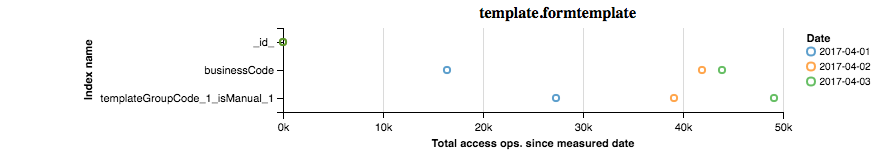
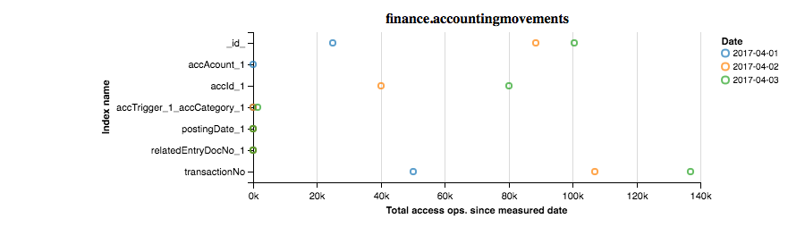
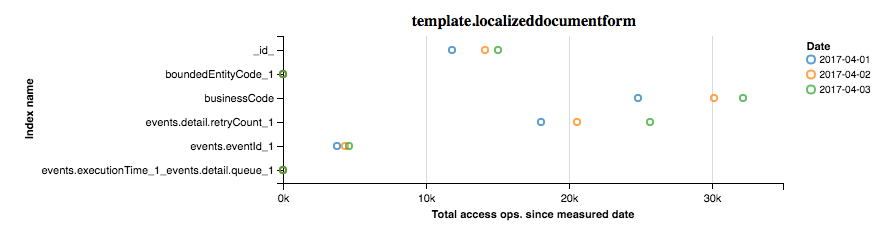

# Mongo index stats

After analyzing your mongod log using [mongo-log-analyzer](https://github.com/martinerko/mongo-log-analyzer) and reviewing your indexes using [mongo-index-reviewer](https://github.com/martinerko/mongo-index-reviewer), it's time to start  monitoring them whether and how often they are being used.

MongoDB since version 3.2 allows you to retrieve statistics regarding the use of each index for collection using [$indexStats](https://docs.mongodb.com/manual/reference/operator/aggregation/indexStats/) operator.

I have created this reporting tool that can help you to see and analyze index usage.

You might easily find out that some of your assumptions might not have been accurate and indexes you created are "useless".

On the other hand, you might also find out that new indexes you have recently introduced quickly become used more often than the old one.

## How to start

1. Make sure you are running MongoDB 3.2 or newer and you have privileges to executed `show collections` and to use `$indexStats` action.

2. Clone this repository

	`git clone https://github.com/martinerko/mongo-log-analyze`

3. Install npm dependencies

	`npm install`

4. Open [cron](https://github.com/martinerko/mongo-index-stats/tree/master/cron) directory and modify `mongo_index_stats.sh` script in order to change the connection string to your database.

5. Run the `mongo_index_stats.sh` script in order to export statistics.

	It will automatically create a `data` directory with subdirectory for current date. Inside the directory, you will find a bunch of files containing statistics for every collection.

6. Open  [example](https://github.com/martinerko/mongo-index-stats/tree/master/example) directory and modify the `index.js` file in order to tell the script to read data from your `data` directory.

7. Run it using `node index.js`

	Script will automatically open your favorite browser with charts per each analyzed collection with information about the use of each index.

8. Setup a cron job

	Cron job should execute `mongo_index_stats.sh` script once per day.
After several days/weeks of collecting statistics, you can generate the report and see how your indexes are performing.

9. If you like it, send me your feedback.

## Modifying report

If you want to modify the output, layout or format of the report, please check the `index.ejs` file located in [template](https://github.com/martinerko/mongo-index-stats/tree/master/template) directory.

This utility is using [Vega](http://vega.github.io/) visualization grammar, so you might be able to quickly modify also the type, look and feel of the reports.

## Additional comments

At this moment, you can use this utility only as a node module. For working example, please see [example](https://github.com/martinerko/mongo-index-stats/tree/master/example) directory.

CLI version coming soon.

## Disclaimer

This utility was created by me during my free time and any usage is at your own risk.

## License

(The MIT License)

Copyright (c) 2017 martinerko

Permission is hereby granted, free of charge, to any person obtaining a copy of this software and associated documentation files (the "Software"), to deal in the Software without restriction, including without limitation the rights to use, copy, modify, merge, publish, distribute, sublicense, and/or sell copies of the Software, and to permit persons to whom the Software is furnished to do so, subject to the following conditions:

The above copyright notice and this permission notice shall be included in all copies or substantial portions of the Software.

THE SOFTWARE IS PROVIDED "AS IS", WITHOUT WARRANTY OF ANY KIND, EXPRESS OR IMPLIED, INCLUDING BUT NOT LIMITED TO THE WARRANTIES OF MERCHANTABILITY, FITNESS FOR A PARTICULAR PURPOSE AND NONINFRINGEMENT. IN NO EVENT SHALL THE AUTHORS OR COPYRIGHT HOLDERS BE LIABLE FOR ANY CLAIM, DAMAGES OR OTHER LIABILITY, WHETHER IN AN ACTION OF CONTRACT, TORT OR OTHERWISE, ARISING FROM, OUT OF OR IN CONNECTION WITH THE SOFTWARE OR THE USE OR OTHER DEALINGS IN THE SOFTWARE.
